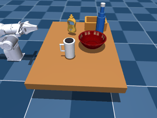

# ECE450 Integration Simulation Demo

One command, from natural language to a MuJoCo grasp: **"put the cup in the
bowl"** &rarr; LLM intent &rarr; (OpenHarmony/ROS2/ROS1 hop, mocked here)
&rarr; visual_grasp's MuJoCo pipeline &rarr; the cup ends up in the bowl.

This repo combines three ECE450 capstone teammates' repositories. It does
not replace any of them -- see [CREDITS.md](CREDITS.md) for exact source
commits and what was changed.

**Status**: the core pipeline above works end to end for this task --
verified through the actual web UI (type a command, approve it) into a live
MuJoCo viewer, not just an offline script. See [Known gaps](#known-gaps--next-steps)
for what's still narrow: object detection is solid for the cup but not the
bottle, `--model menagerie` + `--perception yolo` doesn't work yet, and the
container-detection margin (`--model real` + `--perception yolo`) is real
but not wide.



*Recorded with `--model real` (analytic IK, DH-matched to the physical
Piper) -- not the `menagerie` default, which has no real-robot counterpart --
and `--perception yolo` (real YOLO detection on the rendered wrist-cam image,
not the ground-truth `sim_gt` shortcut): `DETECT_SOURCE conf=0.50 (483 ROI
pts)`, not the `conf=1.00 (0 ROI pts)` signature `sim_gt` always reports.*

## Architecture

```text
 text command
      |
      v
 llm/  (Mingrui Li -- robot-command-demo)
   FastAPI + LLM intent mapper -> validated {intent, parameters} JSON
      |
      v
 integration/oh_bridge_mock.py   <-- stand-in, see "Scope and honesty" below
   (real version: oh_bridge/ -- NikKk0o -- OpenHarmony QEMU -> ROS2 Humble
    -> TCP -> ROS1 Noetic -> visual_grasp ROS1 gateway)
      |
      v
 visual_grasp/multitask/bridge.py  (chuhan + runhanw + team)
   backend=sim_mujoco -> TaskExecutor -> MuJoCo
      |
      v
 cup ends up in the bowl (or a clear error if it doesn't)
```

## Scope and honesty

The **OpenHarmony/ROS2/ROS1 hop is mocked**, not run for real, in this repo.
`integration/oh_bridge_mock.py` is a plain Python function that reproduces
the JSON shape (`visual_grasp.bridge.v1`) the real chain produces, so it's a
drop-in replacement point, not a redesign.

Why it's mocked instead of run for real:

- This demo was assembled on a machine with no KVM (`/dev/kvm` absent), no
  `docker`, no `ros2`, and no `hdc`. OpenHarmony's QEMU emulator needs
  hardware-accelerated virtualization to be usable interactively; without it,
  boot and DDS communication are impractically slow.
- The official lightweight `device_qemu` prebuilt images are LiteOS-kernel
  "small system" demos (microcontroller targets) -- they cannot run
  ROS2/CycloneDDS, so they can't stand in for the real thing either.
- The real OpenHarmony-in-the-loop setup (`oh_bridge/docs/FULL_LAUNCH_AND_CONNECTION_GUIDE.md`)
  is a from-source OpenHarmony build + custom QEMU scripts that currently
  only run on Tim's own machine. Even the teammate who owns the OpenHarmony
  Robot Sim work (`GC1-ZhuangHanyang-OpenHarmony-with-Robotic-Arm`) documents
  that proving control genuinely runs *inside* OpenHarmony OS is still an
  open item for the whole team, not something specific to this repo.

So: the LLM leg and the MuJoCo leg in this repo are real and actually run.
The middle hop is a faithful-shaped placeholder. Swapping it for the real
ROS2/ROS1 chain is future work, to be done on a machine that already has
OpenHarmony QEMU working (Tim's), not rebuilt from scratch here.

## Quick start

### Offline (no API key, no server -- what was used to test this repo)

```bash
MUJOCO_GL=egl python3 integration/run_demo.py --llm-json \
  '{"intent": "place_into", "parameters": {"source_label": "cup", "container_label": "bowl"}}'
```

(`run_demo.py` resolves all paths from its own file location, so it can be
run from any working directory.)

This skips the LLM call entirely and feeds an already-mapped intent straight
into the bridge, so it needs no `ANTHROPIC_API_KEY`/`OPENAI_API_KEY`. It still
runs through `llm/backend/validator.py`'s whitelist, so a malformed or
unsupported intent is rejected the same way a real LLM output would be.

Add `--no-evidence` to skip saving a GIF/PNG of the run; drop it to get one
under `visual_grasp/multitask/evidence/bridge_<task>_<object>.gif`, or add
`--mp4` for a full-resolution MP4 in the same folder instead (better for
filming off a screen than the downscaled GIF).

### Live interactive viewer (needs a machine with a real display)

`run_demo.py` renders offscreen (`MUJOCO_GL=egl`) and only produces a
GIF/MP4 after the fact -- there's no window to watch live. If you're on a
machine with an actual display (not this headless build machine),
`integration/live_viewer_demo.py` opens a real MuJoCo window you can orbit
while the task runs:

```bash
MUJOCO_GL=glfw python3 integration/live_viewer_demo.py --command "put the cup in the bowl"
```

Same `--command` / `--llm-json` / `--from-queue` input modes as `run_demo.py`.
On macOS this needs `mjpython` instead of `python3` (MuJoCo passive-viewer
main-thread requirement, same as `visual_grasp/multitask/grasp_viewer.py`);
on Linux, plain `python3` with a working X/Wayland session is enough.

**Caveat**: this was written and sanity-checked on a machine with no
display -- confirmed everything up through the LLM call, validation, and
world construction runs cleanly, and fails exactly (and only) at
`mujoco.viewer.launch_passive()` with a GLFW "no DISPLAY" error, which is
the expected failure mode headless. The window itself opening and rendering
correctly has not been visually confirmed; if it misbehaves on your display
machine, the error message + which line it's on is what to report back.

### Real LLM call, no server

```bash
cd llm && pip install -r requirements.txt && cp .env.example .env
# edit .env: set LLM_API_KEY
cd ..
MUJOCO_GL=egl python3 integration/run_demo.py --command "put the cup in the bowl"
```

### Full flow with the web UI + human approval (closest to real usage)

```bash
cd llm && uvicorn backend.main:app --host 127.0.0.1 --port 8000 &
# open http://127.0.0.1:8000/app, submit "put the cup in the bowl"
# open http://127.0.0.1:8000/queue, approve it
cd ..
MUJOCO_GL=egl python3 integration/run_demo.py --from-queue
```

`run_demo.py --from-queue` marks the queue item `executed` or `failed` on the
LLM service when it's done, same as a real robot worker would.

### Other tasks

```bash
--llm-json '{"intent": "pick", "parameters": {"source_label": "bottle"}}'
--llm-json '{"intent": "clear_table", "parameters": {"labels": ["cup", "bottle"], "container_label": "bowl"}}'
```

## Repo layout

```text
llm/            robot-command-demo (Mingrui) -- patched, see CREDITS.md
oh_bridge/      capstone-openharmony-integration (Niko) -- reference only, unmodified
visual_grasp/   visual_grasp main branch -- unmodified
integration/    glue code written for this repo (mock OH bridge + orchestrator)
CREDITS.md      exact source commits + what was changed
```

## Known gaps / next steps

- **Real OpenHarmony-in-the-loop**: swap `integration/oh_bridge_mock.py` for
  the real `oh_bridge/` chain once it can run somewhere with OpenHarmony QEMU
  already working (Tim's machine, not rebuilt here).
- **Upstream the semantic-intent patch**: the `llm/backend/*.py` changes in
  this repo should go back to Mingrui as a PR against `robot-command-demo`
  rather than living only as a fork here.
- **`real_piper` backend**: `visual_grasp`'s `main` branch (`piper_backend.py`)
  and `zenghao720` branch (`real_piper_backend.py` + `ros1_gateway.py`)
  independently implement the real-hardware boundary and conflict with each
  other (`multitask/bridge.py`, `tests/test_bridge.py`). This demo sidesteps
  that entirely by only using `backend=sim_mujoco`, which is unaffected by
  the conflict -- but real-hardware work still needs that reconciled.
- **`--model real` (piper_real) place_into/place_at was broken, fixed
  2026-07-25**: diagnosed and fixed across three separate bugs, all in
  `visual_grasp/multitask/{primitives,world,executor}.py`; see those files'
  docstrings/comments for the full evidence chain (waypoint-by-waypoint
  contact and orientation traces, not just end-state checks).
  1. `execute_grasp`'s pre-grasp approach and lift were single-jump moves;
     the PD-driven path between joint configs is uncontrolled and could
     sweep the open gripper through the object before closing, or fling a
     held object on a fast lift. Both now go through `carry_to`
     (Cartesian-interpolated) on the analytic-IK model, and `move_to`
     verifies the arm actually converges to the IK target instead of
     treating "IK found *a* solution" as success.
  2. `release_at`'s carry-to-place leg had the same single-jump problem,
     plus two more found by tracing contact/orientation per waypoint: a
     diagonal straight-line carry clipped the target container's rim
     partway through (knocking the object loose before the gripper ever
     opened, yet still landing close enough to pass the old xy-only
     `VERIFY_DONE` check); and re-targeting a fresh destination-facing
     gripper orientation mid-carry tipped the held object independent of
     any collision, because a 2-finger gripper's roll=0/roll=pi solutions
     are both valid IK branches and which one is analytic-IK-reachable can
     flip partway through an orientation sweep -- a genuine kinematic
     transition, not seed noise (confirmed: chaining the IK seed
     waypoint-to-waypoint didn't change the outcome). `release_at` now
     plans the whole transit+descend as one joint-space waypoint list
     (position linearly interpolated, orientation SLERPed from the held
     frame to the destination frame) and executes it through the existing
     velocity-limited `follow_joint_waypoints`, so any large per-waypoint
     jump gets smoothed instead of snapped.
  3. The fixed `container_release_z_offset: 0.07` left only ~5mm of
     clearance above the container rim for a horizontally side-grasped cup
     (half its height hangs below the grip point) -- razor-thin against
     normal settle error, and what let the object clip the rim in the
     first place. `executor._dynamic_container_release_z` now computes the
     release height from the container's and held object's actual
     collision geometry (`SimWorld.collision_z_range`) plus a configurable
     safety margin (`place.release_clearance_margin`), instead of a fixed
     constant.

  Verified via the full LLM -> bridge -> MuJoCo pipeline (live viewer and
  offline evidence capture): `--model real` `place_into`/`place_at` now
  succeed deterministically across repeated runs and multiple starting arm
  poses, with no regression on the `--model menagerie` default path. The
  CLI default is still `menagerie` (this change didn't touch that), and
  hardware-in-the-loop is still unverified -- everything above was checked
  in MuJoCo, not on the physical Piper. `clear_table`'s bottle leg still
  fails at `DETECT_SOURCE` on both models; that's a separate, pre-existing
  issue unrelated to this fix.

- **`--perception yolo` (real detection, not `sim_gt`) now works end-to-end
  on `--model real`, but only after two more fixes, and still has an open
  gap on `--model menagerie`**: `run_demo.py`/the web-UI pipeline default to
  `--perception sim_gt` (reads MuJoCo body poses directly), so every demo
  gif before this entry -- including the one above, originally -- was
  ground-truth-driven, not vision-driven. Getting `--perception yolo` to
  actually succeed surfaced two separate pre-existing bugs, both in
  `object_registry.scan`'s continuous-motion scan path (`multitask/
  object_registry.py`, `motion.execution_mode: continuous` in
  `config.yaml`), not in anything the piper_real fix above touched:
  - `motion.scan_max_joint_velocity_rad_s: 0.8` was fast enough that the
    `SAFE_TRANSIT` move's tracking error marginally exceeded
    `max_following_error_rad` and raised `MotionSafetyError`, and (on
    `--model real`) the resulting motion blur/incomplete settle at capture
    time was enough to shift the detected container position by an extra
    ~18mm. Lowered to `0.5`; both symptoms went away together.
  - The `detector.scan_poses` default (used whenever a model doesn't
    override it -- currently only `--model real` does) puts `link7` in
    actual contact with the table at both poses (verified directly via
    `SimWorld.measure_table_clearance`), which `continuous` mode's
    clearance check correctly rejects. `--model menagerie` + `--perception
    yolo` still fails on this (`SCAN robot-table contact while settling`)
    for `pick` and every other task -- the generic scan poses need
    retuning the same way `model.real.scan_poses` already were (see that
    entry's comment in `config.yaml`), not attempted here.

  With both fixes, `--model real` + `--perception yolo` `place_into`
  succeeds deterministically (`DETECT_SOURCE conf=0.50`, container detected
  ~52mm from its true center, under the 90mm `xy_tolerance`) -- verified
  repeatedly, not a one-off. The README gif above was re-recorded with this
  exact combination. 52mm against a 90mm budget is a real margin, not a
  wide one; it hasn't been stress-tested across other object positions.
